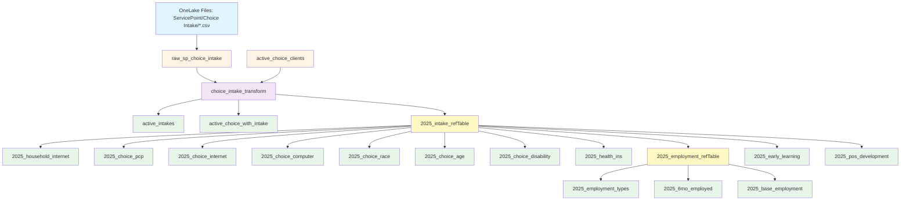

# Choice Intake and Demographics Pipeline

Comprehensive dataflow pipeline for ingesting, transforming, and analyzing intake assessment data from the Choice program, generating demographic and service enrollment reports for federal reporting requirements.

## Pipeline Flow Diagram

---

## Pipeline Architecture

### Stage 1: raw_sp_choice_intake
**Source**: OneLake Files → `ServicePoint/Choice Intake/` folder  
**Output**: `raw_choice_intake` (lakehouse table)  
**Update Frequency**: Manual CSV upload  
**Purpose**: Ingest comprehensive intake assessment data from Choice program enrollment

**File Selection Logic**: 
- Reads only the **most recently modified** CSV file in the folder
- Prevents duplicate data from historical uploads

**Input File Format** (CSV with 70+ columns):

**Client Demographics**:
- Client ID, First Name, Last Name
- Date of Birth, Gender
- Race and Ethnicity, Secondary Race
- Social Security Number

**Enrollment Information**:
- Entry Date, Exit Date
- Household ID, Relationship to Head of Household
- Enrollment CoC (Continuum of Care identifier)

**Education & Youth Services**:
- Current Grade Level, School Name, School Year
- Working At Grade Level (Math, Reading)
- School Attending
- Did student miss >10% of school days
- Is student enrolled in CIS (Communities In Schools)
- Is child enrolled in Lighthouse program
- Which Lighthouse/CIS location
- Is child involved in positive youth development
- Is child participating in Choice Tutoring
- JCAMPUS signed permission on file
- For children 0-5: enrolled in formal early learning program
- Early learning program name

**Employment & Income**:
- Employed? (Yes/No HUD)
- Employer's Name
- Employment Start Date, Employment End Date
- Type of Employment (if yes)
- If Unemployed, Looking for Work
- Enrolled in job training/workforce development
- Participating in vocational school or higher education
- Total Monthly Income
- Income from Any Source
- Non-cash benefit from any source

**Housing & Homelessness**:
- Housing Move-in Date
- Approximate date homelessness started
- Did you stay less than 7 nights
- Did you stay less than 90 days
- On night before, stayed on streets/ES/SH
- Total months homeless in past 3 years
- Number of times homeless in past 3 years

**Health & Wellness**:
- Covered by Health Insurance
- Has disabling condition
- Do you have a PCP (Primary Care Provider)
- Clinic or Doctor's Name
- Date of last physical
- Do you have a regular dentist
- Last Dental Visit
- Do you have a behavioral health provider
- Behavioral health provider/clinic name

**Digital Access & Resources**:
- Internet access at home
- Computer in your home

**Other Information**:
- Marital Status
- Highest Level of Education Attained
- Degree field
- How did you hear about us
- Member of religious community
- Interested in spiritual support
- Survivor of Domestic Violence
- Former resident of Jackson Heights
- Emergency Contact, Emergency Contact Phone

**Transformations**:
1. **Column Renaming**: Maps 70+ verbose ServicePoint column names to snake_case format
2. **Grade Level Standardization**:
   - "Pre-K" → "-1"
   - "K" → "0"
   - Converts to integer type
3. **Employment Flag Standardization**:
   - "Yes (HUD)" → "Employed"
   - "No (HUD)" → "Unemployed"
4. **Homelessness Times Conversion**:
   - "One time (HUD)" → 1
   - "Two times (HUD)" → 2
   - "Three times (HUD)" → 3
   - "Four or more times (HUD)" → 4
5. **Months Homeless Conversion**:
   - "More than 12 months (HUD)" → 13
6. **Deduplication**: Groups by all columns except entry_date, keeps **maximum entry_date** per client
7. **Type Casting**: Dates (entry_date, exit_date, dob, employment dates), integers, decimals

**Output Columns**: 65+ standardized columns (see Input File Format for complete list)

---

### Stage 2: choice_intake_transform
**Inputs**: 
- `raw_choice_intake` (from Stage 1)
- `active_choice_clients` (from active client pipeline)

**Outputs**: Multiple reference and reporting tables

**Purpose**: Transform raw intake data into analysis-ready formats for federal reporting, program evaluation, and demographic analysis

---

## Output Tables

### Intermediate Tables

#### raw_choice_intake (transformed)
**Transformations in this query**:
- Combines first_name and last_name → `client_name` ("Last, First" format)
- Applies all standardization from Stage 1

#### active_intakes
**Purpose**: List of currently active Choice program participants  
**Filter**: `exit_date` IS NULL  
**Use Case**: Quick reference of current enrollment

#### active_choice_with_intake
**Purpose**: Complete profile merging active clients with their intake assessments  
**Logic**:
- Joins `active_choice_clients` with `raw_choice_intake` by client_id
- Deduplicates by taking maximum entry_date per client
- Preserves all intake fields for active clients

---

### Core Reference Tables

#### 2025_intake_refTable
**Purpose**: Master reference table with calculated fields for 2025 calendar year reporting  
**Filter**: Includes clients with exit_date in 2025 (Q1-Q4) OR currently active (null exit_date)

**Calculated Fields**:

1. **exit_qtr_year** (text):
   - Format: "Q# YYYY" (e.g., "Q1 2025")
   - Calculated from exit_date
   - Null if client still active

2. **age** (integer):
   - Whole years as of today
   - Calculated from date of birth
   - Accounts for whether birthday has occurred this year

3. **is_kid_0_6** (boolean):
   - TRUE if age between 0 and 6 (inclusive)
   - Used to filter early learning eligibility
   - Null if age is null

**Column Selection**: Removes school-specific and less commonly used fields, keeping:
- Client identification (id, name, household_id, ssn)
- Core demographics (dob, age, gender, race, race_sec)
- Program enrollment flags (in_cis, in_lighthouse, choice_tutoring)
- Education (early_learning, school_attending, education_attained)
- Employment (employer_name, employment dates, type, flag)
- Health (health_ins, disability, has_pcp, clinic_name)
- Housing (homelessness_start)
- Income sources
- Calculated fields (exit_qtr_year, age, is_kid_0_6)

---

#### 2025_employment_refTable
**Purpose**: Specialized reference for employment analysis  
**Source**: 2025_intake_refTable  
**Filter**: **Disability = "No (HUD)"** (non-disabled adults only, per federal reporting requirements)

**Calculated Fields**:

1. **employment_days** (integer):
   - Days between employment_start_date and employment_end_date
   - If no end date: calculates to today
   - Null if no start date

2. **months_employed** (decimal):
   - employment_days ÷ 30
   - Approximation for reporting purposes

**Selected Columns**:
- client_id, client_name, household_id
- employer_name, employment dates
- employment_type, employed_flag
- disability status
- entry_date, exit_date, age
- employment_days, months_employed

---

### Demographic Reporting Tables

#### 2025_household_internet
**Purpose**: Household internet access counts for 2025  
**Aggregation**: 
- Groups by `internet_access` (Yes/No)
- Counts distinct `household_id` (not clients - avoids duplicates in multi-person households)
- Filters out blank responses

**Output**:
| internet_access | Count |
|----------------|-------|
| Yes            | 152   |
| No             | 48    |

---

#### 2025_choice_pcp
**Purpose**: Primary care provider access summary  
**Aggregation**: Groups by `has_pcp`, counts distinct clients  
**Transformation**: Transposes to single row with Yes/No columns, adds category label

**Output Format**:
| category | Yes | No |
|----------|-----|----|
| Has PCP  | 180 | 35 |

---

#### 2025_choice_internet
**Purpose**: Client internet access (household-level count)  
**Same logic as 2025_household_internet but formatted as transposed single row**

**Output Format**:
| category  | Yes | No |
|-----------|-----|----|
| Internet  | 152 | 48 |

---

#### 2025_choice_computer
**Purpose**: Home computer access summary  
**Aggregation**: Groups by `home_computer`, counts distinct households  
**Transformation**: Transposed single row format

**Output Format**:
| category       | Yes | No |
|----------------|-----|----|
| Home Computer  | 128 | 72 |

---

#### 2025_choice_race
**Purpose**: Racial demographics breakdown  
**Aggregation**: Groups by `race`, counts distinct clients  
**No Filtering**: Includes all race categories reported

**Output Format**:
| race                          | Count |
|-------------------------------|-------|
| Black or African-American     | 185   |
| White                         | 28    |
| Hispanic/Latino               | 12    |
| ... (other categories) ...    | ...   |

---

#### 2025_choice_age
**Purpose**: Age distribution of clients  
**Aggregation**: Groups by `age`, counts distinct clients  
**Sort**: Ascending by age  
**Use Case**: Identify age-appropriate services, youth vs adult programs

**Output Format**:
| age | Count |
|-----|-------|
| 0   | 8     |
| 1   | 12    |
| 2   | 15    |
| ... | ...   |
| 65  | 3     |

---

#### 2025_choice_disability
**Purpose**: Disability status distribution  
**Aggregation**: Groups by `disability`, counts distinct clients

**Output Format**:
| disability | Count |
|------------|-------|
| No (HUD)   | 195   |
| Yes (HUD)  | 20    |

---

#### 2025_health_ins
**Purpose**: Health insurance coverage status  
**Aggregation**: Groups by `health_ins`, counts distinct clients

---

### Employment Reporting Tables

#### 2025_employment_types
**Purpose**: Types of employment among employed clients (non-disabled only)  
**Source**: 2025_employment_refTable  
**Aggregation**: Groups by `employment_type`, counts distinct clients  
**Filter**: Excludes blank employment_type

**Output Format**:
| employment_type    | Count |
|--------------------|-------|
| Full-time          | 68    |
| Part-time          | 42    |
| Seasonal           | 15    |
| ... (other types)  | ...   |

---

#### 2025_6mo_employed
**Purpose**: Clients employed for 6+ months (employment retention metric)  
**Source**: 2025_employment_refTable  
**Filter**: `months_employed >= 6`  
**Aggregation**: Groups by `employment_type`, counts distinct clients

**Output Format**:
| employment_type | Count |
|-----------------|-------|
| Full-time       | 52    |
| Part-time       | 28    |

**Use Case**: Federal reporting on sustained employment outcomes

---

#### 2025_base_employment
**Purpose**: Overall employment status (employed vs unemployed)  
**Source**: 2025_employment_refTable  
**Aggregation**: Groups by `employed_flag`, counts distinct clients  
**Filter**: Excludes blank responses

**Output Format**:
| employed_flag | Count |
|---------------|-------|
| Employed      | 125   |
| Unemployed    | 70    |

---

### Youth Services Reporting Tables

#### 2025_early_learning
**Purpose**: Early learning program enrollment for children 0-6  
**Source**: 2025_intake_refTable  
**Filter**: `is_kid_0_6 = TRUE`  
**Aggregation**: Groups by `early_learning`, counts distinct clients  
**Excludes**: Blank responses

**Output Format**:
| early_learning | Count |
|----------------|-------|
| Yes            | 42    |
| No             | 28    |

**Use Case**: Track early childhood education access for federal Head Start/Early Head Start requirements

---

#### 2025_pos_development
**Purpose**: Positive youth development program participation  
**Source**: 2025_intake_refTable  
**Filter**: `age <= 17` (youth only)  
**Aggregation**: Groups by `positive_youth_dev`, counts distinct clients

**Output Format**:
| positive_youth_dev | Count |
|--------------------|-------|
| Yes                | 87    |
| No                 | 43    |

**Use Case**: Youth program enrollment tracking for grant reporting

---

## Pipeline Execution Order

1. **Stage 1**: `raw_sp_choice_intake` - Ingest most recent intake CSV
2. **Stage 2**: `choice_intake_transform` - Generate all analysis tables

**Runtime**: Stage 2 creates 18+ output tables in parallel

---

## Reporting Year Logic

**2025 Calendar Year Scope**:
- Includes clients who exited in Q1, Q2, Q3, or Q4 of 2025
- Includes currently active clients (exit_date = null)
- Excludes clients who exited before 2025
- Excludes clients who exited in 2026+

This aligns with federal fiscal year reporting requirements (annual program performance reports due quarterly).

---

## Federal Reporting Alignment

### HUD (Housing and Urban Development) Standards
- Employment status uses HUD terminology ("Yes (HUD)", "No (HUD)")
- Homelessness episode tracking follows HUD definitions
- Disability determination per HUD guidelines
- Housing stability metrics (move-in dates, nights homeless)

### Service Categorizations
- **Early Learning**: Children 0-6 formal education (Head Start alignment)
- **Positive Youth Development**: Ages 0-17 enrichment programs
- **Employment Retention**: 6+ months threshold (federal workforce outcome standard)

---

## How the Numbers Are Calculated
*Plain-language explanation for non-technical readers*

### Stage 1: Import Intake Assessments

**Process**: Upload completed Choice program intake forms to OneLake
- **File Location**: ServicePoint folder → Choice Intake subfolder
- **File Format**: CSV export from ServicePoint with all assessment questions
- **System automatically**:
  - Finds the newest file (ignores older versions)
  - Reads all 70+ columns of data
  - Standardizes grade levels (Pre-K becomes -1, K becomes 0)
  - Standardizes Yes/No answers to consistent format
  - Converts dates and numbers to proper format
  - If client has multiple entries, keeps most recent entry date

### Stage 2: Organize for Reporting

#### Step 1: Create Master Reference Table (2025_intake_refTable)

**Purpose**: Add helpful calculated fields to every client record

**Calculations**:
1. **Exit Quarter**: 
   - If client exited in March 2025 → "Q1 2025"
   - If still in program → leave blank
   
2. **Current Age**:
   - Count years from birthdate to today
   - Account for whether birthday has happened this year yet
   - Example: Born 3/15/2010, today is 1/14/2026 → Age 15

3. **Is Child 0-6**:
   - Mark TRUE if age 0, 1, 2, 3, 4, 5, or 6
   - Used to identify early learning eligibility

**Who's Included**: 
- Everyone currently in the program (no exit date)
- Everyone who exited in 2025 (Q1, Q2, Q3, or Q4)

#### Step 2: Create Employment Reference (2025_employment_refTable)

**Purpose**: Calculate employment duration for job retention tracking

**Who's Included**: Non-disabled adults only (per federal reporting rules)

**Calculations**:
1. **Employment Days**:
   - Count days from job start date to job end date
   - If still employed (no end date) → count to today
   
2. **Months Employed**:
   - Employment days ÷ 30 (approximation)
   - Example: 240 days ÷ 30 = 8 months

#### Step 3: Generate Demographic Reports

Each report counts distinct clients or households:

**Internet & Computer Access** (counts HOUSEHOLDS to avoid duplicates):
- Group all clients by their answer (Yes/No)
- Count unique household IDs
- Example: If 3 people live in same house with internet, only count 1 household

**Primary Care Provider**:
- Count clients who said "Yes" to having a PCP
- Count clients who said "No"
- Show side-by-side: "Has PCP: Yes=180, No=35"

**Race Demographics**:
- Group clients by their race category
- Count how many in each category

**Age Distribution**:
- List every age (0 through 65+)
- Count how many clients at each age
- Sort from youngest to oldest

#### Step 4: Generate Employment Reports

**Employment Types** (Full-time, Part-time, Seasonal):
- Only count employed people (excludes unemployed)
- Only count non-disabled adults (federal requirement)
- Group by job type, count clients

**6-Month Employment Retention**:
- Filter to people with "months_employed >= 6"
- Group by job type, count clients
- **Example**: John started work 8/1/2024, today is 1/14/2026
  - Days employed: 531 days
  - Months: 531 ÷ 30 = 17.7 months
  - Included in 6-month retention ✓

**Overall Employment Status**:
- Count total "Employed" clients
- Count total "Unemployed" clients
- Simple Yes/No breakdown

#### Step 5: Generate Youth Services Reports

**Early Learning (Ages 0-6)**:
- Filter: Only children marked as "is_kid_0_6 = TRUE"
- Count how many said "Yes" to early learning enrollment
- Count how many said "No"

**Positive Youth Development (Ages 0-17)**:
- Filter: Only clients age 17 or younger
- Count participation in youth programs

---

## Example Walk-Through

**Scenario**: Sarah Johnson (Client ID: 55555) completes Choice intake on November 10, 2024

### Intake Form Data:
- Name: Sarah Johnson
- DOB: 3/22/1988 (age 37 today)
- Entry Date: 11/10/2024
- Exit Date: (blank - still active)
- Employed: Yes (HUD)
- Employer: ABC Manufacturing
- Employment Start: 6/1/2024
- Employment Type: Full-time
- Disability: No (HUD)
- Has PCP: Yes
- Internet Access: Yes
- Home Computer: No
- Race: Black or African-American

### Stage 1 - Raw Import:
System ingests Sarah's data:
- Converts "Yes (HUD)" → "Employed"
- Keeps entry_date = 11/10/2024
- exit_date stays null (active)

### Stage 2 - Calculations:

**2025_intake_refTable**:
- exit_qtr_year = null (still active)
- age = 37 (calculated from DOB)
- is_kid_0_6 = FALSE (age > 6)

**2025_employment_refTable** (Sarah qualifies - non-disabled adult):
- employment_start_date = 6/1/2024
- employment_end_date = null (still employed)
- employment_days = 592 days (6/1/2024 to 1/14/2026)
- months_employed = 592 ÷ 30 = 19.7 months

**Report Contributions**:

1. **2025_choice_pcp**: Sarah adds +1 to "Yes" count (has PCP)
2. **2025_household_internet**: Sarah's household adds +1 to "Yes" count
3. **2025_choice_computer**: Sarah's household adds +1 to "No" count
4. **2025_choice_race**: Sarah adds +1 to "Black or African-American"
5. **2025_choice_age**: Sarah adds +1 to age 37
6. **2025_base_employment**: Sarah adds +1 to "Employed"
7. **2025_employment_types**: Sarah adds +1 to "Full-time"
8. **2025_6mo_employed**: Sarah adds +1 to "Full-time" (19.7 months > 6)

**Final Impact**: Sarah appears in 8 different report tables, contributing to demographic and outcome metrics for federal reporting.

---

## Data Quality Notes

### Known Considerations

1. **File Selection**: Only most recent upload is processed
   - **Benefit**: Prevents accidental duplication
   - **Requirement**: Must re-upload full dataset if corrections needed

2. **Deduplication**: Maximum entry_date per client retained
   - Handles re-enrollments by keeping most recent entry
   - Exit dates can still vary (tracked separately)

3. **Household Counting**: Internet/Computer use household_id
   - Correctly avoids counting multi-person households multiple times
   - Requires accurate household_id assignment in ServicePoint

4. **Employment Duration**: Uses 30-day month approximation
   - Federal reporting standard
   - Slight variance from actual calendar months

5. **Age Calculation**: Dynamic (calculated at query time)
   - Always current age, not age at enrollment
   - May need static age field for historical comparisons

6. **Disability Filter for Employment**: Federal requirement
   - Employment metrics exclude disabled individuals
   - Aligns with HUD performance standards

7. **Blank/Missing Data**: Most reports filter out blank responses
   - Counts only meaningful Yes/No answers
   - Missing data not included in denominator

---

## Future Enhancements

### Longitudinal Tracking
- Compare year-over-year demographics (2024 vs 2025)
- Track individual client outcomes over time
- Employment progression analysis

### Additional Metrics
- Housing stability outcomes (moved from homeless to housed)
- Income increase tracking (initial vs current)
- Educational attainment progress
- Health utilization (PCP visits, dental visits)

### Data Visualization
- Dashboard integration for real-time reporting
- Geographic mapping (if address data added)
- Trend analysis charts

### Automation
- Scheduled CSV uploads from ServicePoint
- Automated quarterly report generation
- Alert notifications for missing required data

---

## Related Documentation
- [CIS Data Reference](CIS-Data-Reference.md)
- [Lighthouse Attendance Pipeline](Lighthouse-Attendance-Pipeline.md)
- [ServicePoint Data Reference](ServicePoint-Data-Reference.md) (if exists)
