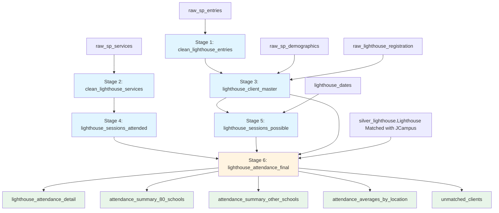

# Lighthouse Attendance Pipeline

Multi-stage dataflow pipeline for calculating lighthouse program attendance rates across 4 nine-week periods.

## Pipeline Flow Diagram

## Pipeline Architecture

### Stage 1: clean_lighthouse_entries
**Input**: `raw_sp_entries`  
**Output**: `clean_lighthouse_entries` (lakehouse table)  
**Purpose**: Deduplicate entries, keep only lighthouse programs  
**Logic**: Group by client_id, take max entry_date and exit_date  
**Columns**: client_id, entry_date, exit_date, program_name

### Stage 2: clean_lighthouse_services  
**Input**: `raw_sp_services`  
**Output**: `clean_lighthouse_services` (lakehouse table)  
**Purpose**: Filter services, add nine_week_period  
**Logic**: Filter to valid dates, assign period based on service_date  
**Columns**: client_id, service_date, nine_week_period, location, service_id

### Stage 3: lighthouse_client_master
**Input**: `clean_lighthouse_entries`, `raw_sp_demographics`, `raw_lighthouse_registration`  
**Output**: `lighthouse_client_master` (lakehouse table)  
**Purpose**: Create one master record per client  
**Logic**: Left joins to get all client info  
**Columns**: client_id, first_name, last_name, entry_date, exit_date, lighthouse_location_enrolling

### Stage 4: lighthouse_sessions_attended
**Input**: `clean_lighthouse_services`  
**Output**: `lighthouse_sessions_attended` (lakehouse table)  
**Purpose**: Count services per client per period  
**Logic**: Group by client_id and nine_week_period, count rows  
**Columns**: client_id, nine_week_period, sessions_attended

### Stage 5: lighthouse_sessions_possible
**Input**: `lighthouse_client_master`, `lighthouse_dates`  
**Output**: `lighthouse_sessions_possible` (lakehouse table)  
**Purpose**: Calculate possible sessions per client per period  
**Logic**: For each client/period, count session days between entry/exit dates  
**Columns**: client_id, nine_week_period, sessions_possible

### Stage 6: lighthouse_attendance_final
**Input**: `lighthouse_sessions_attended`, `lighthouse_sessions_possible`, `lighthouse_client_master`, `silver_lighthouse.Lighthouse Matched with JCampus`  
**Output**: `lighthouse_attendance_detail`, `attendance_summary_80_schools`, `attendance_summary_other_schools`, `attendance_averages_by_location`, `unmatched_clients`  
**Purpose**: Calculate attendance rates, apply thresholds, create reports  
**Logic**: Join all inputs, calculate rates, flag threshold compliance

## Nine-Week Periods
- 1st 9 Weeks: 8/13/2025 - 10/17/2025
- 2nd 9 Weeks: 10/20/2025 - 12/17/2025
- 3rd 9 Weeks: 1/6/2026 - 3/6/2026
- 4th 9 Weeks: 3/16/2026 - 5/21/2026

## Attendance Thresholds
- 80% schools: Bethune/Oak Park, Broadmoor STEM, Creswell Elementary
- 60% schools: All other locations

## Pipeline Execution Order
Run dataflows in sequence: Stage 1 → Stage 2 → Stage 3 → Stage 4 → Stage 5 → Stage 6

Each stage writes to lakehouse, next stage reads from lakehouse tables.

---

## How the Numbers Are Calculated
*Plain-language explanation of data operations for non-technical readers*

### Stage 0: Collection ###
**Process**: In ServicePoint run report xx - Auto Entry v3 report
- **Save to folder attached to the database**
- **Ingested from here to Stage 1.**

### Stage 1: Identify Lighthouse Students
**Process**: Remove duplicate enrollment records and keep only Lighthouse program students
- **Filter**: Keep only records where program name contains "Lighthouse"
- **Group by client ID**: For each student, keep the most recent entry date and exit date
- **Result**: One clean enrollment record per student

### Stage 2: Count Service Records
**Process**: Find all service records for Lighthouse students and assign them to 9-week periods
- **Filter dates**: Keep only services between 8/13/2025 and 5/21/2026
- **Match students**: Keep only services for students in Stage 1's list
- **Assign periods**: Label each service with which 9-week period it falls into (1st, 2nd, 3rd, or 4th)
- **Result**: Every service record tagged with the student ID and which 9-week period it happened in

### Stage 3: Build Student Profile
**Process**: Create a complete profile for each student with all their information
- **Start with**: Clean enrollment data from Stage 1
- **Add demographics**: Match each student to their name from the demographics table
- **Add school location**: Match each student to their enrolling location from registration records
- **Result**: One master record per student with name, entry/exit dates, and school location

### Stage 4: Calculate Sessions Attended
**Process**: Count how many times each student showed up during each 9-week period
- **Group services**: Take all service records from Stage 2, group them by student ID and 9-week period
- **Count rows**: Count how many service records exist for each student in each period
- **Result**: For example, "Student #12345 attended 15 sessions during 1st 9 Weeks"

### Stage 5: Calculate Sessions Possible
**Process**: Determine how many sessions each student *could have* attended based on when they were enrolled
- **For each student and period**: Look at the calendar of session days
- **Check enrollment dates**: Only count session days that fall between the student's entry date and exit date
- **Count valid days**: Count how many session days they were actually enrolled for
- **Result**: For example, "Student #12345 could have attended 20 sessions during 1st 9 Weeks"

### Stage 6: Calculate Attendance Rates and Compliance
**Process**: Combine attendance numbers with school information to determine if students meet requirements
- **Join the data**: Combine sessions attended (Stage 4), sessions possible (Stage 5), student profiles (Stage 3), and school matches, subtract out absent days from otherwise potential session dates
- **Calculate percentage**: Divide sessions attended by sessions possible to get attendance rate
- **Apply school rules**: 
  - Bethune/Oak Park, Broadmoor STEM, Creswell Elementary require 80% attendance
  - All other schools require 60% attendance
- **Flag compliance**: Mark whether each student meets their school's attendance requirement
- **Create summaries**: Generate reports showing:
  - Individual student attendance details
  - Summaries by school type (80% vs 60% requirement)
  - Average attendance by location
  - Students who couldn't be matched to a school held separately to improve future matching

### Example Walk-Through
If student Jane Doe (ID: 12345) enrolled on 8/20/2025:

1. **Stage 1**: The pipeline finds her enrollment record and keeps her entry date of 8/20/2025
2. **Stage 2**: All her service records are found and labeled with their 9-week period
3. **Stage 3**: Her name (Jane Doe) and school (Broadmoor STEM) are added
4. **Stage 4**: Her 16 service records during the 1st 9 Weeks are counted
5. **Stage 5**: The 18 possible session days between 8/20/2025 and 10/17/2025 are counted
6. **Stage 6**: The calculation shows 16 ÷ 18 = 88.9% attendance. Since Broadmoor STEM requires 80%, Jane meets her requirement ✓